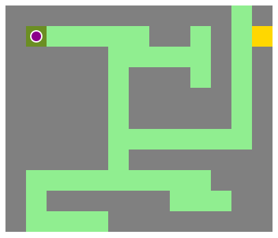

# A-MAZEing
*A pawn's quest to find a treasure (or the exit) in a maze.*

[A-MAZEing](https://gaudrey.github.io/amazeing/)

## Project infos
* *Duration:* 2-3 days
* *Deadline:* 25 november 2020, 19:00
* *Team challenge:* solo

## Objectives
* Build a maze with JS.
* The pawn cannot move on the walls or exit the maze if it's not the exit/treasure tile.

## What did I use?
* HTML
* CSS
* JS

## How did I do it?
I tried three differents things but in the end, I choose to design the maze by restrincting the area with the number of tiles in the width.

Each type of tile is designed in the css (one type = one class : wall, path, start, treasure).

The pawn is placed in the div used as the starting point and moved inside each div defined as "path".

## How does it move?
It moves because of the `div:nth-child()`. The nth-child number is used as position and changed when the pawn is moved.

The tile class "wall" is used to prevent the pawn to move on a wall. If the class list contains the tile class "wall", it doesn't move. And for the out of bounds, a position is defined to prevent a move to.

## Work with my choice
I was too focus on a solution and when it works, I realised that it was too late for me to adapt it for other levels with different design. The project is complete for that level but not really optimized (or I don't see how to do it yet).

I joined my two other js files in the "tests" folder. One with a test to try to recover the length of the maze level (but not used yet) and one with a 2D system to build the maze (but also incomplete).

## What can be improved?
Obviously, my code doesn't work for other levels. Clearly, it's my main problem with this project. Or it can works but with many things that I need to rewrite directly and add to the existing code (like the starting position and the conditions for the out of bound problem).

## What I would have liked to try?
* Change the pawn color with an imput radio.
* Add a sound when the goal is reached.
* Change the design of the maze (dungeon map, forest map, etc) like the pawn color but with buttons.
